<
2. [User Roles](#2-user-roles)
3. [Architecture Diagram](#3-architecture-diagram)
4. [Component Breakdown](#4-component-breakdown)
5. [Data Flow Diagrams](#5-data-flow-diagrams)
6. [Database Schema](#6-database-schema)
7. [API Endpoints](#7-api-endpoints)
8. [Rule Engine Logic](#8-rule-engine-logic)
9. [Error Handling & Edge Cases](#9-error-handling--edge-cases)
10. [Scalability Considerations](#10-scalability-considerations)
11. [Security Measures](#11-security-measures)
12. [Deployment Strategy](#12-deployment-strategy)
13. [Future Extensions](#13-future-extensions)

---

## 1. System Overview

VIAS is a decision-support platform designed to provide climate-smart agricultural advisories to smallholder rice farmers in West Bengal, India. The system integrates real-time weather data, pest surveillance reports, and market prices to generate actionable recommendations.

### Primary Objectives

| Objective | Description |
|-----------|-------------|
| **Risk Prediction** | Identify pest/disease and climate risks before they cause crop damage |
| **Advisory Delivery** | Provide timely, localized recommendations in vernacular (Bengali) |
| **Market Intelligence** | Display live mandi prices to optimize selling decisions |
| **Scheme Access** | Surface relevant government schemes with eligibility checks |

### System Boundaries

- **In Scope:** Rice cultivation for Kharif/Aman season in West Bengal
- **Out of Scope:** Other crops, states, or post-harvest processing

---

## 2. User Roles

### 2.1 Farmer (Primary User)

| Attribute | Description |
|-----------|-------------|
| **Access Level** | Read-only dashboard, personal advisory |
| **Capabilities** | View village dashboard, enter field data, receive risk alerts |
| **Authentication** | Phone + OTP (future) |
| **Typical Device** | Low-end Android smartphone, 2G/3G network |

### 2.2 Village Coordinator

| Attribute | Description |
|-----------|-------------|
| **Access Level** | Village-level data management |
| **Capabilities** | Add/edit farmer records, submit pest reports, view aggregated stats |
| **Authentication** | Username + Password |
| **Typical Device** | Smartphone or desktop at Common Service Centre (CSC) |

### 2.3 Viewer (Guest)

| Attribute | Description |
|-----------|-------------|
| **Access Level** | Read-only, anonymized data |
| **Capabilities** | View public dashboard, weather, prices (no personal data) |
| **Authentication** | None required |
| **Purpose** | Demonstration, research, media access |

### Role-Permission Matrix

```
┌───────────────────────┬─────────┬─────────────┬────────┐
│ Feature               │ Farmer  │ Coordinator │ Viewer │
├───────────────────────┼─────────┼─────────────┼────────┤
│ View Dashboard        │   ✓     │      ✓      │   ✓    │
│ Personal Advisory     │   ✓     │      ✓      │   ✗    │
│ Submit Pest Report    │   ✓     │      ✓      │   ✗    │
│ Add/Edit Farmers      │   ✗     │      ✓      │   ✗    │
│ View All Farmer Data  │   ✗     │      ✓      │   ✗    │
│ Export Reports        │   ✗     │      ✓      │   ✗    │
│ Admin Settings        │   ✗     │      ✗      │   ✗    │
└───────────────────────┴─────────┴─────────────┴────────┘
```

---

## 3. Architecture Diagram

### 3.1 High-Level Architecture

```
┌─────────────────────────────────────────────────────────────────────────────────┐
│                                  CLIENT LAYER                                    │
│  ┌──────────────────────────────────────────────────────────────────────────┐   │
│  │                          Next.js Frontend (App Router)                    │   │
│  │  ┌───────────┐  ┌───────────┐  ┌───────────┐  ┌───────────┐  ┌────────┐ │   │
│  │  │ Dashboard │  │ Advisory  │  │  Schemes  │  │  Farmers  │  │  Auth  │ │   │
│  │  │  /dashboard│  │/advisory │  │ /schemes  │  │ /farmers  │  │ /login │ │   │
│  │  └─────┬─────┘  └─────┬─────┘  └─────┬─────┘  └─────┬─────┘  └───┬────┘ │   │
│  │        │              │              │              │            │       │   │
│  │  ┌─────┴──────────────┴──────────────┴──────────────┴────────────┴────┐  │   │
│  │  │                      React Context Providers                       │  │   │
│  │  │  AuthContext │ LanguageContext │ ThemeContext │ AccessibilityCtx  │  │   │
│  │  └────────────────────────────────────────────────────────────────────┘  │   │
│  └────────────────────────────────────────────────────────────────────┬─────┘   │
│                                                                       │         │
└───────────────────────────────────────────────────────────────────────┼─────────┘
                                                                        │
                                                                        ▼
┌─────────────────────────────────────────────────────────────────────────────────┐
│                                   API LAYER                                      │
│  ┌──────────────────────────────────────────────────────────────────────────┐   │
│  │                        Next.js API Routes (/api/*)                        │   │
│  │  ┌─────────────┐  ┌─────────────┐  ┌─────────────┐  ┌──────────────────┐ │   │
│  │  │ /api/weather│  │ /api/schemes│  │ /api/farmers│  │    /api/news     │ │   │
│  │  │             │  │             │  │             │  │                  │ │   │
│  │  │ GET: fetch  │  │ GET: list   │  │ GET: list   │  │ GET: RSS fetch   │ │   │
│  │  │ weather data│  │ POST: filter│  │ POST: create│  │                  │ │   │
│  │  └──────┬──────┘  └──────┬──────┘  └──────┬──────┘  └────────┬─────────┘ │   │
│  └─────────┼────────────────┼────────────────┼──────────────────┼───────────┘   │
│            │                │                │                  │               │
└────────────┼────────────────┼────────────────┼──────────────────┼───────────────┘
             │                │                │                  │
             ▼                ▼                ▼                  ▼
┌─────────────────────────────────────────────────────────────────────────────────┐
│                             SERVICE / LOGIC LAYER                                │
│  ┌─────────────────────┐  ┌─────────────────────┐  ┌─────────────────────────┐  │
│  │     RISK ENGINE     │  │    DATA LAYER       │  │    EXTERNAL SERVICES    │  │
│  │  ┌───────────────┐  │  │  ┌───────────────┐  │  │  ┌───────────────────┐  │  │
│  │  │ calculateRisk │  │  │  │ mockVillage   │  │  │  │   Open-Meteo API  │  │  │
│  │  │ checkBlast    │  │  │  │ translations  │  │  │  │  (Weather Data)   │  │  │
│  │  │ checkDrought  │  │  │  │ mandiRates    │  │  │  └───────────────────┘  │  │
│  │  │ checkFlood    │  │  │  │ cropCalendar  │  │  │  ┌───────────────────┐  │  │
│  │  │ checkBPH      │  │  │  │ govtSchemes   │  │  │  │   RSS News Feeds  │  │  │
│  │  │ checkColdHeat │  │  │  └───────────────┘  │  │  │  (Agri News)      │  │  │
│  │  └───────────────┘  │  │                     │  │  └───────────────────┘  │  │
│  └─────────────────────┘  └─────────────────────┘  └─────────────────────────┘  │
└─────────────────────────────────────────────────────────────────────────────────┘
```

### 3.2 Deployment Architecture

```mermaid
flowchart TB
    subgraph Client["Client Devices"]
        Mobile["📱 Mobile Browser"]
        Desktop["💻 Desktop Browser"]
    end

    subgraph CDN["CDN Edge"]
        Vercel["Vercel Edge Network"]
    end

    subgraph Server["Next.js Server"]
        SSR["Server-Side Rendering"]
        API["API Routes"]
        Static["Static Assets"]
    end

    subgraph External["External Services"]
        Weather["Open-Meteo API"]
        News["RSS Feeds"]
    end

    Mobile --> Vercel
    Desktop --> Vercel
    Vercel --> SSR
    Vercel --> Static
    SSR --> API
    API --> Weather
    API --> News
```



---

## 4. Component Breakdown

### 4.1 Frontend Components

| Component | Path | Purpose |
|-----------|------|---------|
| `DashboardPage` | `/app/dashboard/page.tsx` | Main village overview with all widgets |
| `VillageSelector` | `/app/dashboard/village-selector.tsx` | Dropdown for village selection |
| `AdvisoryPage` | `/app/advisory/page.tsx` | Interactive risk calculator form |
| `SchemesPage` | `/app/schemes/page.tsx` | Government scheme listing |
| `LanguageToggle` | `/components/LanguageToggle.tsx` | EN/BN language switcher |
| `ThemeToggle` | `/components/ThemeToggle.tsx` | Dark/light mode toggle |
| `AccessibilityPanel` | `/components/AccessibilityPanel.tsx` | Font size, contrast controls |
| `Charts` | `/components/Charts.tsx` | Temperature/rainfall visualizations |
| `MarqueeTicker` | `/components/MarqueeTicker.tsx` | Scrolling price ticker |
| `Tooltip` | `/components/Tooltip.tsx` | Accessible tooltip component |

### 4.2 Backend (API Routes)

| Route | Method | Function |
|-------|--------|----------|
| `/api/weather` | GET | Proxy to Open-Meteo, formats response |
| `/api/news` | GET | Fetches agricultural news RSS |
| `/api/schemes` | GET | Returns government schemes list |
| `/api/farmers` | GET, POST | Farmer CRUD operations |

### 4.3 Rule Engine

| Module | Function | Purpose |
|--------|----------|---------|
| `riskEngine.ts` | `calculateMultiRisk()` | Main entry point, returns all risks |
| | `checkBlastRisk()` | Evaluates blast disease probability |
| | `checkBrownSpotRisk()` | Evaluates brown spot probability |
| | `checkDroughtRisk()` | Evaluates drought stress |
| | `checkFloodRisk()` | Evaluates flood risk |
| | `calculateCropStage()` | Determines current growth stage |
| | `estimateYield()` | Projects yield based on risk score |

### 4.4 External APIs

| API | Provider | Data Provided | Rate Limit |
|-----|----------|---------------|------------|
| Weather Forecast | Open-Meteo | 7-day forecast, current conditions | Unlimited (Free) |
| News Aggregation | Public RSS | Agricultural news headlines | N/A |

### 4.5 Data Layer

| File | Content | Format |
|------|---------|--------|
| `mockVillage.ts` | Farmer records, village stats | TypeScript objects |
| `translations.ts` | EN/BN string mappings | Key-value pairs |
| `mandiRates.ts` | Market price functions | Dynamic generation |
| `governmentSchemes.ts` | Scheme details, MSP rates | Static arrays |
| `cropCalendar.ts` | Kharif activity schedule | Date-based lookups |
| `villages.ts` | Village coordinates | Lat/long mappings |

---

## 5. Data Flow Diagrams

### 5.1 Dashboard Load Flow


### 5.2 Risk Advisory Flow


### 5.3 Village Selection Flow


---

## 6. Database Schema

> **Note:** Current implementation uses in-memory TypeScript data. Below is the target schema for future database integration.

### 6.1 Entity-Relationship Diagram


### 6.2 Table Definitions

#### `farmers`
| Column | Type | Constraints |
|--------|------|-------------|
| `id` | UUID | PRIMARY KEY |
| `village_id` | UUID | FOREIGN KEY |
| `name` | VARCHAR(100) | NOT NULL |
| `phone` | VARCHAR(15) | UNIQUE |
| `aadhaar_hash` | VARCHAR(64) | NULLABLE |
| `ward` | INTEGER | CHECK (1-10) |
| `land_area_acres` | DECIMAL(5,2) | NOT NULL |
| `land_type` | ENUM | Irrigated, Rainfed, Partial |
| `pm_kisan_registered` | BOOLEAN | DEFAULT FALSE |
| `kcc_holder` | BOOLEAN | DEFAULT FALSE |
| `created_at` | TIMESTAMP | DEFAULT NOW() |

#### `pest_reports`
| Column | Type | Constraints |
|--------|------|-------------|
| `id` | UUID | PRIMARY KEY |
| `farmer_id` | UUID | FOREIGN KEY |
| `pest_type` | ENUM | Blast, BPH, etc. |
| `severity` | ENUM | LOW, MEDIUM, HIGH |
| `affected_area_pct` | INTEGER | CHECK (0-100) |
| `symptoms` | TEXT | NULLABLE |
| `reported_at` | TIMESTAMP | DEFAULT NOW() |
| `verified_by` | VARCHAR(100) | NULLABLE |
| `status` | ENUM | Pending, Verified, Resolved |

---

## 7. API Endpoints

### 7.1 Weather API

**Endpoint:** `GET /api/weather`

**Request:**
```
GET /api/weather?lat=23.42&long=87.91&village=Bhatar
```

**Response:**
```json
{
  "current": {
    "temperature": 28.5,
    "humidity": 78,
    "rain": 0,
    "windSpeed": 12.3
  },
  "daily": {
    "time": ["2025-12-09", "2025-12-10", "..."],
    "tempMax": [31, 30, "..."],
    "tempMin": [18, 17, "..."],
    "rainSum": [0, 5, "..."],
    "uvIndex": [7, 8, "..."]
  },
  "location": {
    "lat": 23.42,
    "long": 87.91,
    "name": "Bhatar"
  }
}
```

**Error Response (503):**
```json
{
  "error": "Weather service temporarily unavailable",
  "current": { "temperature": 28, "humidity": 75, "rain": 0, "windSpeed": 10 },
  "daily": { "time": [], "tempMax": [], "tempMin": [], "rainSum": [], "uvIndex": [] }
}
```

### 7.2 Schemes API

**Endpoint:** `GET /api/schemes`

**Response:**
```json
{
  "schemes": [
    {
      "id": "pmkisan",
      "name": "PM-KISAN",
      "status": "Year-round",
      "benefits": ["₹6,000 per year", "Direct bank transfer"],
      "deadline": null,
      "link": "https://pmkisan.gov.in"
    }
  ],
  "msp_rates": [
    { "crop": "Paddy (Common)", "mspPerQuintal": 2183, "year": "2024-25" }
  ]
}
```

### 7.3 Farmers API

**Endpoint:** `GET /api/farmers?village=Bhatar`

**Response:**
```json
{
  "farmers": [...],
  "total": 10,
  "village_stats": {
    "totalAcreage": 14.8,
    "dominantVariety": "Swarna",
    "pmKisanCoverage": 90
  }
}
```

**Endpoint:** `POST /api/farmers`

**Request:**
```json
{
  "name": "New Farmer",
  "phone": "9876543210",
  "village": "Bhatar",
  "landAreaAcres": 1.5,
  "landType": "Irrigated"
}
```

---

## 8. Rule Engine Logic

### 8.1 Risk Calculation Pipeline

```
┌─────────────────────────────────────────────────────────────────────────┐
│                         RISK CALCULATION PIPELINE                        │
└─────────────────────────────────────────────────────────────────────────┘
                                    │
                                    ▼
┌─────────────────────────────────────────────────────────────────────────┐
│  INPUTS                                                                  │
│  ┌────────────────────────┐    ┌────────────────────────────────────┐   │
│  │ Weather Data           │    │ Crop Data                          │   │
│  │ • temp_avg, min, max   │    │ • stage (Seedling→Maturity)        │   │
│  │ • humidity_avg         │    │ • sowing_date                      │   │
│  │ • rainfall_mm          │    │ • variety (Short/Medium/Long)      │   │
│  │ • forecast_days_rain   │    │ • soil_type                        │   │
│  │ • wind_speed           │    │                                    │   │
│  └────────────────────────┘    └────────────────────────────────────┘   │
└────────────────────────────────────┬────────────────────────────────────┘
                                     │
                                     ▼
┌─────────────────────────────────────────────────────────────────────────┐
│  STAGE VULNERABILITY MULTIPLIER                                          │
│  Each crop stage has different susceptibility to each risk type          │
│  e.g., Flowering stage: Blast=1.0, Drought=0.9, Cold=1.0                │
└────────────────────────────────────┬────────────────────────────────────┘
                                     │
                                     ▼
┌─────────────────────────────────────────────────────────────────────────┐
│  INDIVIDUAL RISK CHECKS (Parallel)                                       │
│  ┌──────────┐  ┌──────────┐  ┌──────────┐  ┌──────────┐  ┌──────────┐  │
│  │  Blast   │  │ Brown    │  │   BPH    │  │ Drought  │  │  Flood   │  │
│  │  Risk    │  │  Spot    │  │   Risk   │  │  Risk    │  │  Risk    │  │
│  └────┬─────┘  └────┬─────┘  └────┬─────┘  └────┬─────┘  └────┬─────┘  │
│       │             │             │             │             │        │
│       ▼             ▼             ▼             ▼             ▼        │
│  ┌──────────────────────────────────────────────────────────────────┐  │
│  │                      RISK RESULT ARRAY                            │  │
│  │  [ { riskType, riskLevel, severity, recommendation }, ... ]      │  │
│  └──────────────────────────────────────────────────────────────────┘  │
└────────────────────────────────────┬────────────────────────────────────┘
                                     │
                                     ▼
┌─────────────────────────────────────────────────────────────────────────┐
│  RANKING & AGGREGATION                                                   │
│  1. Sort by severity (descending)                                        │
│  2. Primary risk = highest severity                                      │
│  3. Secondary risks = next 2-3 significant risks                        │
│  4. Overall score = weighted average                                     │
└────────────────────────────────────┬────────────────────────────────────┘
                                     │
                                     ▼
┌─────────────────────────────────────────────────────────────────────────┐
│  OUTPUT: MultiRiskResult                                                 │
│  {                                                                       │
│    primaryRisk: { riskType, riskLevel, severity, recommendation },      │
│    secondaryRisks: [...],                                               │
│    overallRiskScore: 0-100,                                             │
│    summary: "Human readable summary"                                     │
│  }                                                                       │
└─────────────────────────────────────────────────────────────────────────┘
```

### 8.2 Thresholds

| Risk Type | Trigger Conditions | Threshold |
|-----------|-------------------|-----------|
| **Blast** | Humidity > 85%, Temp 20-28°C, Rain > 0 | All conditions met |
| **Brown Spot** | Humidity fluctuation, low rainfall | Stress indicators |
| **Sheath Blight** | Humidity > 85%, Dense canopy period | Booting/Flowering |
| **BPH** | Night temp > 25°C, Wind < 5 km/h | Both conditions |
| **Stem Borer** | Temp > 30°C, No rain, Tillering | All conditions |
| **Drought** | Rainfall = 0, Temp > 35°C, Low humidity | Extended period |
| **Flood** | Rainfall > 100mm forecast | Single day |
| **Cold Stress** | Night temp < 15°C, Flowering | Critical stage |
| **Heat Stress** | Day temp > 35°C, Grain filling | Critical stage |

---

## 9. Error Handling & Edge Cases

### 9.1 Error Categories

| Category | Handling Strategy |
|----------|-------------------|
| **Network Failure** | Return cached/fallback data with warning banner |
| **Invalid Input** | Form validation with clear error messages |
| **API Timeout** | 5-second timeout, graceful degradation |
| **Missing Data** | Default values with "Data unavailable" indicators |

### 9.2 Edge Cases

| Scenario | Handling |
|----------|----------|
| **Sowing date in future** | Disable risk calculation, show info message |
| **Sowing date > 180 days ago** | Assume harvested, suggest new cycle entry |
| **No internet connection** | Show last cached dashboard, disable refresh |
| **Village not found** | Redirect to default village (Bhatar) |
| **Extreme weather values** | Cap at realistic bounds (e.g., temp 0-50°C) |

### 9.3 Fallback Data

Weather API failure returns:
- Temperature: 28°C (average for region)
- Humidity: 75%
- Rainfall: 0mm
- Wind: 10 km/h

---

## 10. Scalability Considerations

### 10.1 Current Capacity

| Metric | Current | Rationale |
|--------|---------|-----------|
| Villages | 5 | Hardcoded in data layer |
| Farmers per village | 20 | Mock data limit |
| Concurrent users | ~100 | Vercel serverless limits |
| API calls/day | Unlimited | Open-Meteo has no rate limit |

### 10.2 Scaling Strategy

```
PHASE 1 (Current)           PHASE 2 (1K Users)         PHASE 3 (100K Users)
┌─────────────────┐         ┌─────────────────┐        ┌─────────────────────┐
│  Static Data    │   →     │  PostgreSQL DB  │   →    │  Distributed DB     │
│  Vercel Edge    │         │  Redis Cache    │        │  CDN + Edge Workers│
│  Single Region  │         │  Multi-region   │        │  Multi-region DB    │
└─────────────────┘         └─────────────────┘        └─────────────────────┘
```

### 10.3 Recommended Optimizations

1. **Database Migration:** Move from TypeScript objects to PostgreSQL
2. **Caching Layer:** Redis for weather data (30-min TTL)
3. **API Rate Limiting:** Implement per-user quotas
4. **Image CDN:** Serve static assets from CDN edge
5. **Background Jobs:** Async processing for bulk operations

---

## 11. Security Measures

### 11.1 Current Implementation

| Area | Measure |
|------|---------|
| **Data Transmission** | HTTPS enforced via Vercel |
| **Input Validation** | TypeScript type checking |
| **XSS Prevention** | React automatic escaping |
| **CSRF** | Not applicable (no state-changing forms yet) |

### 11.2 Recommended Additions

| Area | Recommendation |
|------|----------------|
| **Authentication** | NextAuth.js with phone OTP |
| **Authorization** | Role-based access control (RBAC) |
| **Data Encryption** | Encrypt Aadhaar data at rest (AES-256) |
| **API Security** | Rate limiting, API keys for external access |
| **Audit Logging** | Track all data modifications |
| **Dependency Scanning** | Automated vulnerability checks (Snyk/Dependabot) |

### 11.3 PII Handling

| Data Element | Sensitivity | Storage Policy |
|--------------|-------------|----------------|
| Phone Number | Medium | Store hashed, display masked (XXXX01) |
| Aadhaar | High | Store last 4 digits only, encrypted |
| Name | Low | Plain text, required for display |
| Location | Low | Village-level only, no GPS tracking |

---

## 12. Deployment Strategy

### 12.1 Environments

| Environment | URL | Purpose |
|-------------|-----|---------|
| Development | `localhost:3000` | Local development |
| Preview | `*.vercel.app` | PR preview deployments |
| Production | `vias.example.com` | Live user-facing |

### 12.2 CI/CD Pipeline


### 12.3 Deployment Checklist

- [ ] All tests passing (`npm test`)
- [ ] Build successful (`npm run build`)
- [ ] Environment variables configured
- [ ] Database migrations applied (future)
- [ ] Cache invalidated
- [ ] Smoke tests passed

---

## 13. Future Extensions

### 13.1 Short-Term (3-6 months)

| Feature | Description | Priority |
|---------|-------------|----------|
| **Persistent Database** | PostgreSQL for farmer data | High |
| **OTP Authentication** | Phone-based login | High |
| **Offline Mode** | PWA with service worker caching | Medium |
| **Push Notifications** | Web push for alerts | Medium |

### 13.2 Medium-Term (6-12 months)

| Feature | Description | Priority |
|---------|-------------|----------|
| **Image-Based Pest Detection** | TensorFlow.js ML model | High |
| **WhatsApp Integration** | Bot for advisories | High |
| **Voice Advisories** | Bengali text-to-speech | Medium |
| **Satellite Imagery** | NDVI crop health analysis | Medium |

### 13.3 Long-Term (12+ months)

| Feature | Description | Priority |
|---------|-------------|----------|
| **Multi-State Expansion** | Odisha, Bihar, Jharkhand | High |
| **Multi-Crop Support** | Wheat, jute, vegetables | Medium |
| **Yield Prediction ML** | Historical data-based forecasting | Medium |
| **Insurance Integration** | PMFBY claim assistance | Low |

---

## Appendix

### A. Glossary

| Term | Definition |
|------|------------|
| **MSP** | Minimum Support Price (government procurement rate) |
| **BPH** | Brown Planthopper (Nilaparvata lugens) |
| **Kharif** | Monsoon cropping season (June-November) |
| **Rabi** | Winter cropping season (November-April) |
| **FPO** | Farmer Producer Organization |
| **KCC** | Kisan Credit Card |

### B. References

- [Open-Meteo API Documentation](https://open-meteo.com/en/docs)
- [ICAR Rice Knowledge Bank](https://www.rkmp.co.in/)
- [PM-KISAN Portal](https://pmkisan.gov.in/)
- [PMFBY Guidelines](https://pmfby.gov.in/)

---

*End of Technical Design Document*
]]>
